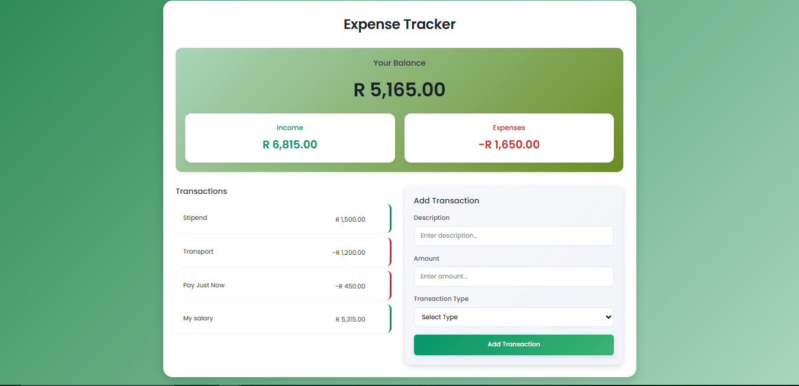

# Expense Tracker

A simple web-based Expense Tracker application to help you manage your income and expenses. Built with HTML, CSS, and JavaScript.

## Features

- **Track Transactions:** Add income and expense transactions with descriptions and amounts.
- **View Summary:** See your current balance, total income, and total expenses.
- **Transaction List:** View all added transactions in a list.
- **Responsive Design:** Works on desktop and mobile devices.

## Getting Started

### Prerequisites

- A modern web browser (Chrome, Firefox, Edge, etc.)

### Installation

1. **Clone the repository:**
   ```sh
   git clone https://github.com/your-username/Expense-Tracker.git
   ```
2. **Navigate to the project folder:**
   ```sh
   cd Expense-Tracker
   ```
3. **Open `index.html` in your browser:**
   - Double-click `index.html`
   - Or right-click and choose "Open with" > your browser

## Usage

1. **Add a Transaction:**
   - Enter a description (e.g., "Salary", "Groceries").
   - Enter the amount.
   - Select the transaction type (Income or Expense).
   - Click "Add Transaction".

2. **View Transactions:**
   - All transactions will appear in the list.
   - Your balance, income, and expenses update automatically.

## File Structure

```
Expense-Tracker/
│
├── index.html      # Main HTML file
├── style.css       # Stylesheet
└── script.js       # JavaScript logic
```

## Customization

- **Styling:** Modify `style.css` to change the look and feel.
- **Logic:** Enhance features in `script.js` (e.g., add delete/edit functionality).

## Contributing

Contributions are welcome! Please fork the repository and submit a pull request.

## License

This project is licensed under the MIT License.

## Author

Willem April

---

**Demo Screenshot:**


